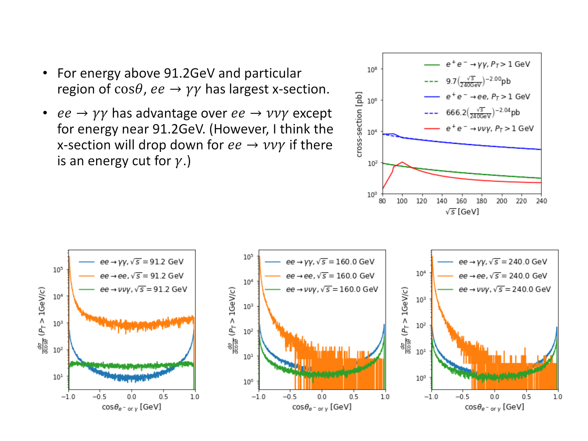

# `ee -> aa`, `ee-> vva` and luminosity measurement

(a stands for photon and v means the neutrino). Bhabha scattering (`e-e+ -> e-e+`) is normally used for luminosity measurement at e-e+ collider e.g. CEPC, FCC-ee, and ILC.
This projects summarize the x-section of `ee -> aa` and `ee -> vva` obtained by `Madgraph` to investigate the possiblility of new luminosity measurement  method utilizing these channels.

